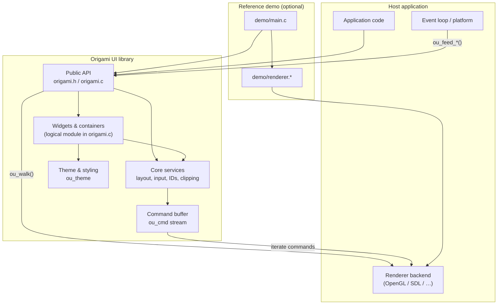
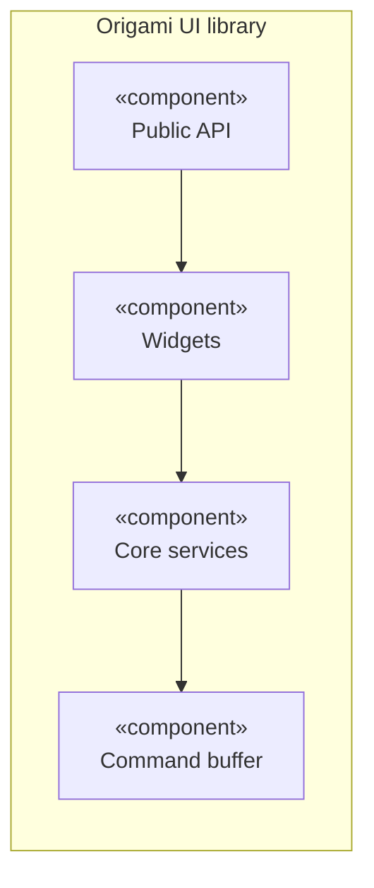
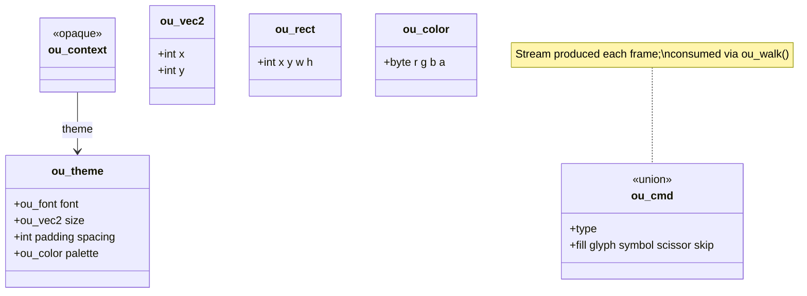
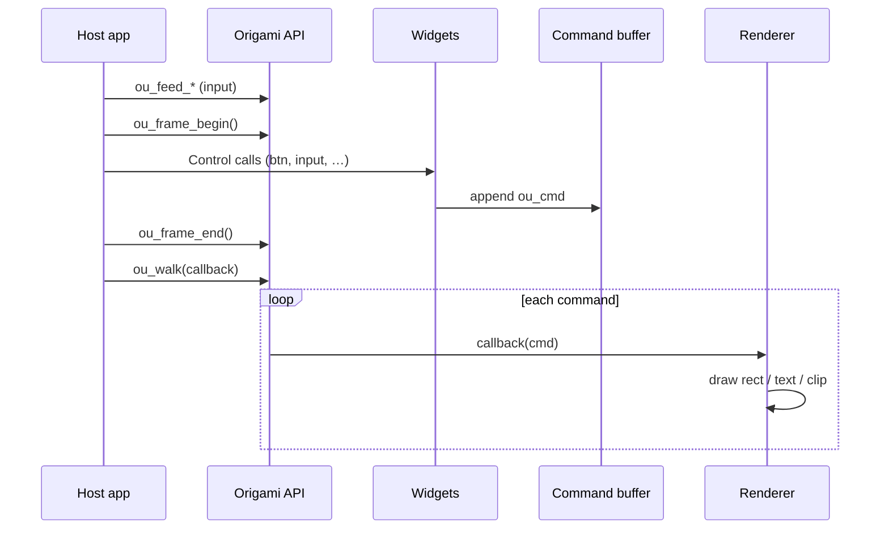
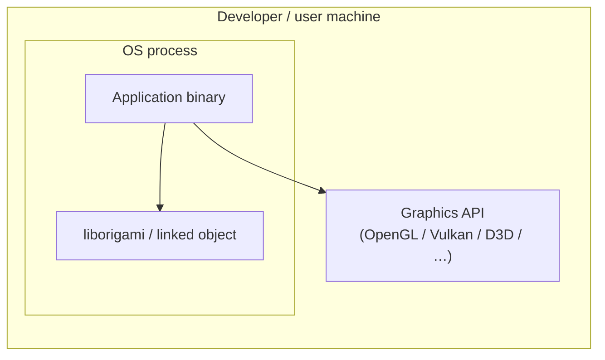

# Origami UI — High-Level Software Architecture

**Version:** 1.0  
**Date:** March 2026  
**Status:** Initial (high-level; internal details may evolve)

---

## 1. Architectural choice

### 1.1 Selected style

| Approach                    | Use in Origami                                                                                                     |
| --------------------------- | ------------------------------------------------------------------------------------------------------------------ |
| **Layered architecture**    | Clear separation: public API → widgets/layout → core services → command output → host renderer                     |
| **Modular monolith**        | Single C library artifact (`origami.c` / `origami.h`), compiled as one unit; internal responsibilities are logical modules within `origami.c` |
| **Immediate-mode pipeline** | Per-frame flow: input → layout & widgets → command buffer → `ou_walk()` → backend                                  |

### 1.2 Rationale (short)

- The **host** owns the window, event loop, and GPU; Origami stays **embeddable** and **dependency-free** (stdlib only in core).
- **Layers** match how developers integrate the library: call API, get abstract draw commands, implement rendering.
- A **monolithic library** keeps deployment simple (one link, fixed memory in `ou_context`) and matches the “no dynamic allocation” constraint.

### 1.3 Relationship to other documents

- Detailed control-level design: `[SoftwareDesignDocument.md](SoftwareDesignDocument.md)`  
- Requirements: `[Software-Requirements-Document.md](Software-Requirements-Document.md)`

---

## 2. Top-level component structure

The following **component diagram** shows major building blocks and dependencies (top → bottom: higher layers depend on lower).

Component boundaries above are conceptual for design clarity. For v1.0 distribution, the core library remains exactly two files: `origami.h` and `origami.c`.

---

## 3. Interfaces between components

High-level contracts (inputs/outputs at the boundary). Parameter names are indicative; see `origami.h` for exact types.

### 3.1 Host ↔ Origami (public API)

| Interface         | Caller → Callee | Input                                                     | Output                                 |
| ----------------- | --------------- | --------------------------------------------------------- | -------------------------------------- |
| **Lifecycle**     | App → Origami   | `ou_context`*, `text_width` / `text_height` callbacks     | Initialized context                    |
| **Frame**         | App → Origami   | `ou_frame_begin()` / `ou_frame_end()` around widget calls | Filled command buffer; balanced stacks |
| **Input feed**    | App → Origami   | `ou_feed_mouse()`, `ou_feed_key()`, …                     | Updated hover/focus hit-testing        |
| **Command drain** | App → Origami   | `ou_walk(ctx, user_data, callback)`                       | Per-command dispatch to renderer       |
| **Signals**       | Origami → App   | Return values from controls                               | `OU_SIGNAL_`* bit flags                |

### 3.2 Widgets ↔ Core

| Interface           | Input                    | Output                                        |
| ------------------- | ------------------------ | --------------------------------------------- |
| **Layout**          | Grid/column state, rects | Allocated regions (`ou_allocate`, row/column) |
| **Identity**        | Stable string / id       | `ou_id` (hash) for focus and cache            |
| **Hit & sense**     | Pointer state, rect      | Interaction signals                           |
| **Draw primitives** | Colors, rects, text      | Appended `ou_cmd` entries                     |

### 3.3 Origami ↔ Renderer (application-side)

| Interface              | Input                                              | Output                               |
| ---------------------- | -------------------------------------------------- | ------------------------------------ |
| `**ou_walk` callback** | Each `ou_cmd` (fill, glyph, symbol, scissor, skip) | Side effect: draw calls in host API  |
| **Text metrics**       | String, font                                       | Width / height in pixels (callbacks) |

---

## 4. UML representations

### 4.1 Component diagram (UML-style)

> For **PlantUML** (strict UML tooling), see `[uml/component.puml](uml/component.puml)`.

### 4.2 Class diagram (C structs + API groups)

Core data shapes and command union (conceptual; full definitions in `origami.h`).

### 4.3 Sequence diagram — one frame (build UI + render)

### 4.4 Deployment diagram (typical)

Single process: application executable links Origami static or shared library; GPU access via host renderer.

---

## 5. Source files for diagrams

Portable **PlantUML** sources (for VS Code, JetBrains, or `plantuml.jar`) live in `[doc/uml/](uml/)`. Prefer those if your course requires strict UML tooling.

---

## 6. Version history

| Version | Date       | Notes                                       |
| ------- | ---------- | ------------------------------------------- |
| 1.0     | March 2026 | Initial high-level architecture + UML views |

